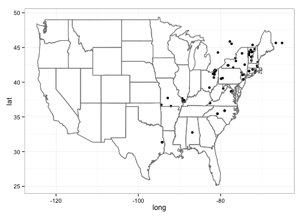

 [](https://travis-ci.org/ropensci/rinat)

# `riNat`


## Quickstart guide
 
 
## About
R wrapper for iNaturalist APIs for accessing the observations. The Detailed documentation of API is available on [iNaturlaist website](http://www.inaturalist.org/pages/api+reference) and is part of our larger species occurence searching packages [SPOCC](http://github.com/ropensci/spocc)


## Install

### Install the development version using `install_github` within Hadley's [devtools](https://github.com/hadley/devtools) package.


```r
install.packages("devtools")
require(devtools)

install_github("rinat", "ropensci")
require(rinat)
```


## Get observations

__Searching__

_Fuzzy search_

You can search for observations by either common or latin name.  It will search the entire iNaturalist entry, so the search below will return all entries that mention Monarch butterflies, not just entries for Monarchs.


```r
butterflies <- get_inat_obs(query = "Monarch Butterfly")
```


Another use for a fuzzy search is searching for a common name or habitat, e.g. searching for all observations that might happen in a vernal pool.  We can then see all the species names found.  

```r
vp_obs <- get_inat_obs(query = "vernal pool")
head(vp_obs$Species.guess)
```

```
## [1] "Eastern Hemlock (Tsuga canadensis)"
## [2] "Folded Downingia"                  
## [3] "Thysanocarpus curvipes"            
## [4] "Turkey-tail"                       
## [5] "snail"                             
## [6] "Marbled salamander"
```


_Taxon query_
To return only records for a specific species or taxonomic group, use the taxon option.


```r
## Return just observations in the family Plecoptera
stone_flies <- get_inat_obs(taxon = "Plecoptera")

## Return just Monarch Butterfly records
just_butterflies <- get_inat_obs(taxon = "Danaus plexippus")
```


_Bounding box search_

You can also search within a bounding box by giving a simple set of coordinates.


```r
## Search by area

bounds <- c(38.44047, -125, 40.86652, -121.837)
deer <- get_inat_obs(query = "Mule Deer", bounds = bounds)
```


__Other functions__


_Get information and observations by project_

You can get all the observations for a project if you know it's ID or name as an intaturalist slug


```r
## Just get info about a project
vt_crows <- get_inat_obs_project("crows-in-vermont", type = "info", raw = FALSE)
```

```
## 22  Records
## 0
```

```r
## Now get all the observations for that project
vt_crows_obs <- get_inat_obs_project(vt_crows$id, type = "observations")
```

```
## 22  Records
## 0-100
```


_Get observation details_

Detailed information about a specific observation can be retrieved by observation ID.  The easiest way to get the ID is from a more general search.


```r
m_obs <- get_inat_obs(query = "Monarch Butterfly")
head(get_inat_obs_id(m_obs$Id[1]))
```

```
## $comments_count
## [1] 0
## 
## $created_at
## [1] "2013-12-05T09:03:48-06:00"
## 
## $delta
## [1] FALSE
## 
## $description
## [1] ""
## 
## $geoprivacy
## NULL
## 
## $iconic_taxon_id
## [1] 47158
```


_Get all observations by user_

If you just want all the observations by a user you can download all their observations by user ID.  A word of warning though, this can be quite large (easily into the 1000's)


```r
m_obs <- get_inat_obs(query = "Monarch Butterfly")
head(get_inat_obs_user(as.character(m_obs$User.login[1]), maxresults = 20))[, 
    1:5]
```

```
##            Scientific.name                  Datetime
## 1        Limenitis camilla 2013-08-31 07:18:43 +0000
## 2         Danaus plexippus 2013-09-18 14:46:08 +0000
## 3                          2013-08-31 05:48:50 +0000
## 4     Sceloporus undulatus 2013-08-04 06:28:01 +0000
## 5          Battus philenor 2013-08-03 12:16:45 +0000
## 6 Macroglossum stellatarum 2013-07-20 10:30:20 +0000
##                Description
## 1                         
## 2                         
## 3 Caterpillar on goldenrod
## 4                         
## 5                         
## 6                         
##                                        Place.guess Latitude
## 1   900 Sherman Hollow Rd, Huntington, Vermont, US    44.35
## 2 Adirondack Park Preserve, Vergennes, Vermont, US    44.09
## 3   815 Sherman Hollow Rd, Huntington, Vermont, US    44.35
## 4                                                        NA
## 5    213 Alabama Ter, Montreat, North Carolina, US    35.65
## 6   900 Sherman Hollow Rd, Huntington, Vermont, US    44.35
```


_Stats by taxa_

Basic statistics are available for taxa counts by date, date range, place ID (numeric ID), or user ID (string)


```r
## By date
counts <- get_inat_taxon_stats(date = "2010-06-14")
counts
```

```
## subspecies      genus    species    variety 
##          1          3         41          1
```

```r

## By place_ID
vt_crows <- get_inat_obs_project("crows-in-vermont", type = "info", raw = FALSE)
```

```
## 22  Records
## 0
```

```r
place_counts <- get_inat_taxon_stats(place = vt_crows$place_id)
place_counts
```

```
##      phylum superfamily       tribe superphylum       class   subfamily 
##          10          12           2           1          17          11 
##      family   epifamily       genus       order    suborder  subspecies 
##         132           1         475          32           8          50 
##    subclass     variety      hybrid     kingdom        form          fo 
##           1          24          14           5           3           1 
##     species 
##        2837
```


_Stats by user_

Similar statistics can be gotten for users.  The same input parameters can be used, but results are the top five users by species count and observation count.


```r
## By date
counts <- get_inat_user_stats(date = "2010-06-14")
counts
```

```
## $species
##   count user.id user.login   user.name
## 1    10    9706 greglasley Greg Lasley
## 2     4   10285    finatic   BJ Stacey
## 3     3     382    tsoleau            
## 4     3     873   tapbirds   Scott Cox
## 5     3    3403     davidr     David R
## 
## $observatinos
##   count user.id user.login   user.name
## 1    10    9706 greglasley Greg Lasley
## 2     4   10285    finatic   BJ Stacey
## 3     4     357  annetanne            
## 4     3     382    tsoleau            
## 5     3    3403     davidr     David R
```

```r

## By place_ID
vt_crows <- get_inat_obs_project("crows-in-vermont", type = "info", raw = FALSE)
```

```
## 22  Records
## 0
```

```r
place_counts <- get_inat_user_stats(place = vt_crows$place_id)
place_counts
```

```
## $species
##   count user.id   user.login      user.name
## 1  1177   12610 susanelliott               
## 2  1021   11792    kylejones     Kyle Jones
## 3   828   12045     larry522 Larry Clarfeld
## 4   815     317     catharus Kent McFarland
## 5   709    2179      charlie   Charlie Hohn
## 
## $observatinos
##   count user.id   user.login      user.name
## 1  4968    2179      charlie   Charlie Hohn
## 2  2370   12610 susanelliott               
## 3  2186     317     catharus Kent McFarland
## 4  1976   11792    kylejones     Kyle Jones
## 5  1364    3847       rpayne      Ron Payne
```


## Mapping.

Basic maps can be created as well to quickly visualize search results.  Maps can either be plotted automatically `plot = TRUE` or simply return a ggplot2 object with `plot = FALSE`.  This works well with single species data, but more complicated plots are best made from scratch.


```r
## Map salamanders in the genuse Ambystoma
m_obs <- get_obs_inat(taxon = "Ambystoma maculatum")

salamander_map <- inat_map(m_obs, plot = FALSE)
### Now we can modify the returned map
salamander_map + borders("state") + theme_bw()
```

```
## Warning: Removed 6 rows containing missing values (geom_point).
```




