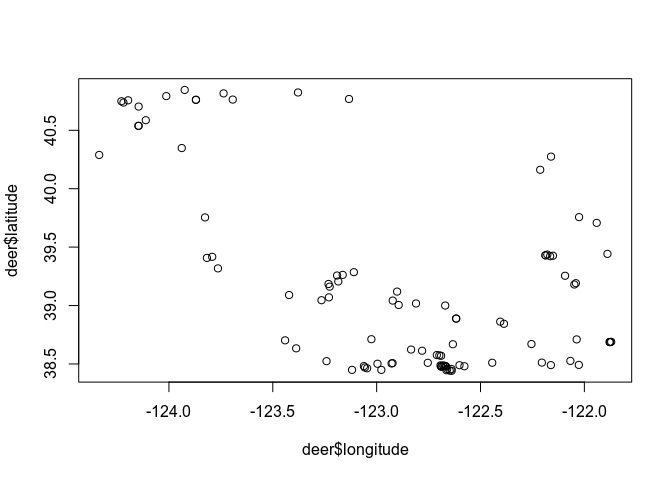
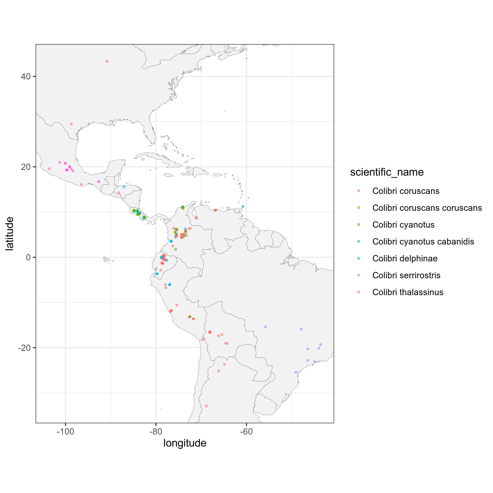

rinat: Access iNaturalist data with R
================
Edmund Hart, Stéphane Guillou

[](https://travis-ci.org/ropensci/rinat)
[](https://ci.appveyor.com/project/sckott/rinat/branch/master)
[](https://codecov.io/github/ropensci/rinat?branch=master)
[](http://cran.rstudio.com/web/packages/rinat/index.html)

## About

R wrapper for iNaturalist APIs for accessing the observations. The
detailed documentation of the API is available on [iNaturalist
website](http://www.inaturalist.org/pages/api+reference) and is part of
our larger species occurrence searching packages
[SPOCC](http://github.com/ropensci/spocc).

## Quickstart guide

### Get observations

#### Fuzzy search

You can search for observations by either common or scientific name. It
will search the entire iNaturalist database, so the search below will
return all entries that mention Monarch butterflies, not just entries
for Monarchs.

``` r
library(rinat)
butterflies <- get_inat_obs(query = "Monarch Butterfly")
```

Another use for a fuzzy search is searching for a common name or
habitat, e.g. searching for all observations that might happen in a
vernal pool. We can then see all the species names found.

``` r
vp_obs <- get_inat_obs(query = "vernal pool")
head(vp_obs$species_guess)
```

    ## [1] "Mollisia ventosa" ""                 "water plantain"   "Plants"          
    ## [5] "Common Cudweed"   "Flowering Plants"

#### Taxon query

To return only records for a specific species or taxonomic group, use
the taxon option.

``` r
## Return just 2020 observations in the family Nymphalidae
nymphalidae <- get_inat_obs(taxon_name  = "Nymphalidae", year = 2020)

## Return just Monarch Butterfly records
monarchs <- get_inat_obs(taxon_name = "Danaus plexippus")
```

#### Bounding box search

You can also search within a bounding box by giving a simple set of
coordinates.

``` r
## Search by area
bounds <- c(38.44047, -125, 40.86652, -121.837)
deer <- get_inat_obs(query = "Mule Deer", bounds = bounds)
plot(deer$longitude, deer$latitude)
```

<!-- -->

### Other functions

#### Get information and observations by project

You can get all the observations for a project if you know its ID or
name as an iNaturalist slug.

``` r
## Just get info about a project
vt_crows <- get_inat_obs_project("crows-in-vermont", type = "info", raw = FALSE)
```

    ## 177  Records

``` r
## Now get all the observations for that project
vt_crows_obs <- get_inat_obs_project(vt_crows$id, type = "observations")
```

    ## 177  Records
    ## 0-200

#### Get observation details

Detailed information about a specific observation can be retrieved by
observation ID. The easiest way to get the ID is from a more general
search.

``` r
m_obs <- get_inat_obs(query = "Monarch Butterfly")
head(get_inat_obs_id(m_obs$id[1]))
```

    ## $id
    ## [1] 53695185
    ## 
    ## $observed_on
    ## [1] "2020-07-19"
    ## 
    ## $description
    ## NULL
    ## 
    ## $latitude
    ## [1] "41.36618333"
    ## 
    ## $longitude
    ## [1] "-73.81943667"
    ## 
    ## $map_scale
    ## NULL

#### Get all observations by user

If you just want all the observations by a user you can download all
their observations by user ID. A word of warning though, this can be
quite large (easily into the 1000’s).

``` r
user_obs <- get_inat_obs_user(m_obs$user_login[1], maxresults = 20)
head(user_obs)[,1:5]
```

    ##          scientific_name                  datetime  description
    ## 1       Danaus plexippus 2020-07-19 17:58:29 -0400             
    ## 2      Myodocha serripes 2020-07-19 11:52:37 -0400             
    ## 3          Juncus tenuis 2020-07-17 13:48:34 -0400             
    ## 4 Capnoides sempervirens 2020-07-17 14:02:54 -0400             
    ## 5        Verbena hastata 2020-07-16 10:22:10 -0400             
    ## 6      Prunella vulgaris 2020-07-16 09:20:22 -0400 Photo by Kay
    ##                                place_guess latitude
    ## 1 Piano Mountain Rd, Putnam Valley, NY, US 41.36618
    ## 2 Piano Mountain Rd, Putnam Valley, NY, US 41.36616
    ## 3 Piano Mountain Rd, Putnam Valley, NY, US 41.36598
    ## 4 Piano Mountain Rd, Putnam Valley, NY, US 41.36583
    ## 5 Piano Mountain Rd, Putnam Valley, NY, US 41.36638
    ## 6       Rochdale Rd, Putnam Valley, NY, US 41.36364

#### Stats by taxa

Basic statistics are available for taxa counts by date, date range,
place ID (numeric ID), or user ID (string). Only the top 5 species are
listed.

``` r
## By date
counts <- get_inat_taxon_stats(date = "2020-06-14")
counts$total
```

    ## [1] 23712

``` r
### Top 5 species
counts$species_counts
```

    ##   count taxon.id           taxon.name taxon.rank taxon.rank_level
    ## 1   308    52821 Achillea millefolium    species               10
    ## 2   299    51875   Trifolium pratense    species               10
    ## 3   299    56057 Leucanthemum vulgare    species               10
    ## 4   297    55745     Trifolium repens    species               10
    ## 5   288    48484    Harmonia axyridis    species               10
    ##   taxon.default_name.id taxon.default_name.name taxon.default_name.is_valid
    ## 1                942097           common yarrow                        TRUE
    ## 2                942055              red clover                        TRUE
    ## 3                924783             oxeye daisy                        TRUE
    ## 4                943715            white clover                        TRUE
    ## 5                 89147       Asian Lady Beetle                        TRUE
    ##   taxon.default_name.lexicon taxon.default_name.taxon_id
    ## 1                    English                       52821
    ## 2                    English                       51875
    ## 3                    English                       56057
    ## 4                    English                       55745
    ## 5                    English                       48484
    ##   taxon.default_name.created_at taxon.default_name.updated_at
    ## 1      2017-08-07T02:40:53.003Z      2019-09-17T18:12:58.008Z
    ## 2      2017-08-07T01:27:15.421Z      2018-01-02T15:59:53.501Z
    ## 3      2017-06-08T19:00:12.460Z      2018-01-10T00:03:27.724Z
    ## 4      2017-08-13T16:25:49.758Z      2019-12-25T11:01:09.924Z
    ## 5      2010-02-17T12:47:07.000Z      2020-04-19T20:53:55.647Z
    ##   taxon.default_name.creator_id taxon.default_name.position
    ## 1                        516268                           0
    ## 2                        516268                           0
    ## 3                        498994                          17
    ## 4                        516268                           0
    ## 5                           357                           0
    ##                                                                                                                  taxon.image_url
    ## 1                                                               https://static.inaturalist.org/photos/4902/square.jpg?1545379591
    ## 2 https://upload.wikimedia.org/wikipedia/commons/thumb/a/ae/Trifolium_pratense_-_Keila2.jpg/75px-Trifolium_pratense_-_Keila2.jpg
    ## 3                                                            https://static.inaturalist.org/photos/8923230/square.jpg?1499562261
    ## 4                                                                https://live.staticflickr.com/5604/30763110446_8a33878c19_s.jpg
    ## 5                                                            https://static.inaturalist.org/photos/4163058/square.jpg?1467490585
    ##   taxon.iconic_taxon_name taxon.conservation_status_name
    ## 1                 Plantae                           <NA>
    ## 2                 Plantae                  least_concern
    ## 3                 Plantae                           <NA>
    ## 4                 Plantae                           <NA>
    ## 5                 Insecta                           <NA>

``` r
### Most common taxon ranks
counts$rank_counts
```

    ## $species
    ## [1] 17235
    ## 
    ## $genus
    ## [1] 3626
    ## 
    ## $subspecies
    ## [1] 619
    ## 
    ## $family
    ## [1] 615
    ## 
    ## $subfamily
    ## [1] 345
    ## 
    ## $tribe
    ## [1] 327
    ## 
    ## $variety
    ## [1] 183
    ## 
    ## $order
    ## [1] 135
    ## 
    ## $subgenus
    ## [1] 102
    ## 
    ## $superfamily
    ## [1] 83
    ## 
    ## $hybrid
    ## [1] 74
    ## 
    ## $subtribe
    ## [1] 68
    ## 
    ## $section
    ## [1] 41
    ## 
    ## $class
    ## [1] 39
    ## 
    ## $complex
    ## [1] 37
    ## 
    ## $suborder
    ## [1] 29
    ## 
    ## $infraorder
    ## [1] 25
    ## 
    ## $phylum
    ## [1] 23
    ## 
    ## $subclass
    ## [1] 13
    ## 
    ## $form
    ## [1] 11
    ## 
    ## $subphylum
    ## [1] 7
    ## 
    ## $infraclass
    ## [1] 5
    ## 
    ## $kingdom
    ## [1] 5
    ## 
    ## $subsection
    ## [1] 4
    ## 
    ## $superorder
    ## [1] 3
    ## 
    ## $epifamily
    ## [1] 2
    ## 
    ## $genushybrid
    ## [1] 2
    ## 
    ## $zoosection
    ## [1] 2
    ## 
    ## $zoosubsection
    ## [1] 2
    ## 
    ## $parvorder
    ## [1] 1

#### Stats by user

Similar statistics can be gotten for users. The same input parameters
can be used.

``` r
## By date
counts <- get_inat_user_stats(date = "2010-06-14")
counts$total
```

    ## [1] 226

``` r
counts$most_observations[1:10,]
```

    ##    count user.id      user.login              user.name
    ## 1     53  811118     sandbankspp                       
    ## 2     34  541847      billhubick            Bill Hubick
    ## 3     25   46945             abe           T. Abe Lloyd
    ## 4     25  761669 kathleenfspicer                   <NA>
    ## 5     21    2616     alice_abela            Alice Abela
    ## 6     21  495266        maxa11an    Max Allan Niklasson
    ## 7     20  922078        hakai470 ES470: Hakai Institute
    ## 8     19 1588724         jrcagle                       
    ## 9     12  357375     richardling           Richard Ling
    ## 10    12  522214      tdavenport        Tripp Davenport
    ##                                                                     user.user_icon_url
    ## 1  https://static.inaturalist.org/attachments/users/icons/811118/thumb.jpeg?1535236899
    ## 2   https://static.inaturalist.org/attachments/users/icons/541847/thumb.jpg?1582771190
    ## 3    https://static.inaturalist.org/attachments/users/icons/46945/thumb.jpg?1475588685
    ## 4                                                                                 <NA>
    ## 5     https://static.inaturalist.org/attachments/users/icons/2616/thumb.jpg?1475528533
    ## 6  https://static.inaturalist.org/attachments/users/icons/495266/thumb.jpeg?1579782546
    ## 7                                                                                 <NA>
    ## 8  https://static.inaturalist.org/attachments/users/icons/1588724/thumb.jpg?1566852095
    ## 9   https://static.inaturalist.org/attachments/users/icons/357375/thumb.jpg?1484462740
    ## 10  https://static.inaturalist.org/attachments/users/icons/522214/thumb.jpg?1558671195

``` r
counts$most_species[1:10,]
```

    ##    count user.id      user.login              user.name
    ## 1     47  811118     sandbankspp                       
    ## 2     24  761669 kathleenfspicer                   <NA>
    ## 3     20   46945             abe           T. Abe Lloyd
    ## 4     17    2616     alice_abela            Alice Abela
    ## 5     17  495266        maxa11an    Max Allan Niklasson
    ## 6     17  541847      billhubick            Bill Hubick
    ## 7     14  922078        hakai470 ES470: Hakai Institute
    ## 8     14 1588724         jrcagle                       
    ## 9     10    9706      greglasley            Greg Lasley
    ## 10    10  357375     richardling           Richard Ling
    ##                                                                     user.user_icon_url
    ## 1  https://static.inaturalist.org/attachments/users/icons/811118/thumb.jpeg?1535236899
    ## 2                                                                                 <NA>
    ## 3    https://static.inaturalist.org/attachments/users/icons/46945/thumb.jpg?1475588685
    ## 4     https://static.inaturalist.org/attachments/users/icons/2616/thumb.jpg?1475528533
    ## 5  https://static.inaturalist.org/attachments/users/icons/495266/thumb.jpeg?1579782546
    ## 6   https://static.inaturalist.org/attachments/users/icons/541847/thumb.jpg?1582771190
    ## 7                                                                                 <NA>
    ## 8  https://static.inaturalist.org/attachments/users/icons/1588724/thumb.jpg?1566852095
    ## 9     https://static.inaturalist.org/attachments/users/icons/9706/thumb.jpg?1533329961
    ## 10  https://static.inaturalist.org/attachments/users/icons/357375/thumb.jpg?1484462740

``` r
## By place_ID
vt_crows <- get_inat_obs_project("crows-in-vermont", type = "info", raw = FALSE)
```

    ## 177  Records

``` r
place_counts <- get_inat_user_stats(place = vt_crows$place_id)
place_counts$total
```

    ## [1] 9831

``` r
place_counts$most_observations[1:10,]
```

    ##    count user.id    user.login      user.name
    ## 1  52571   12158 erikamitchell Erika Mitchell
    ## 2  35047    2179       charlie   Charlie Hohn
    ## 3  16461   12610  susanelliott  Susan Elliott
    ## 4  10108   12045      larry522 Larry Clarfeld
    ## 5   8743   12036       zaccota       Zac Cota
    ## 6   8016  108365     judywelna               
    ## 7   7573     317   kpmcfarland Kent McFarland
    ## 8   7527    6624   joannerusso               
    ## 9   7355   13355        beeboy  Spencer Hardy
    ## 10  7252   28921         rwp84    roy pilcher
    ##                                                                    user.user_icon_url
    ## 1   https://static.inaturalist.org/attachments/users/icons/12158/thumb.jpg?1586465563
    ## 2    https://static.inaturalist.org/attachments/users/icons/2179/thumb.jpg?1569109298
    ## 3   https://static.inaturalist.org/attachments/users/icons/12610/thumb.jpg?1475533475
    ## 4   https://static.inaturalist.org/attachments/users/icons/12045/thumb.jpg?1475533238
    ## 5   https://static.inaturalist.org/attachments/users/icons/12036/thumb.jpg?1475533232
    ## 6  https://static.inaturalist.org/attachments/users/icons/108365/thumb.jpg?1475547470
    ## 7     https://static.inaturalist.org/attachments/users/icons/317/thumb.jpg?1475527502
    ## 8   https://static.inaturalist.org/attachments/users/icons/6624/thumb.jpeg?1562532360
    ## 9   https://static.inaturalist.org/attachments/users/icons/13355/thumb.jpg?1475533838
    ## 10  https://static.inaturalist.org/attachments/users/icons/28921/thumb.jpg?1588726887

``` r
place_counts$most_species[1:10,]
```

    ##    count user.id          user.login           user.name
    ## 1   2700   12158       erikamitchell      Erika Mitchell
    ## 2   2217   12045            larry522      Larry Clarfeld
    ## 3   2207   12610        susanelliott       Susan Elliott
    ## 4   1829    2179             charlie        Charlie Hohn
    ## 5   1677    6624         joannerusso                    
    ## 6   1491 1088797 montpelierbioblitz1 Montpelier BioBlitz
    ## 7   1481   13355              beeboy       Spencer Hardy
    ## 8   1474   11792           kylejones          Kyle Jones
    ## 9   1357  108365           judywelna                    
    ## 10  1356     317         kpmcfarland      Kent McFarland
    ##                                                                    user.user_icon_url
    ## 1   https://static.inaturalist.org/attachments/users/icons/12158/thumb.jpg?1586465563
    ## 2   https://static.inaturalist.org/attachments/users/icons/12045/thumb.jpg?1475533238
    ## 3   https://static.inaturalist.org/attachments/users/icons/12610/thumb.jpg?1475533475
    ## 4    https://static.inaturalist.org/attachments/users/icons/2179/thumb.jpg?1569109298
    ## 5   https://static.inaturalist.org/attachments/users/icons/6624/thumb.jpeg?1562532360
    ## 6                                                                                <NA>
    ## 7   https://static.inaturalist.org/attachments/users/icons/13355/thumb.jpg?1475533838
    ## 8   https://static.inaturalist.org/attachments/users/icons/11792/thumb.jpg?1475533125
    ## 9  https://static.inaturalist.org/attachments/users/icons/108365/thumb.jpg?1475547470
    ## 10    https://static.inaturalist.org/attachments/users/icons/317/thumb.jpg?1475527502

### Mapping

Basic maps can be created as well to quickly visualize search results.
Maps can either be plotted automatically with `plot = TRUE` (the
default), or simply return a ggplot2 object with `plot = FALSE`. This
works well with single species data, but more complicated plots are best
made from scratch.

``` r
library(ggplot2)

## Map 100 spotted salamanders
a_mac <- get_inat_obs(taxon_name = "Ambystoma maculatum")
salamander_map <- inat_map(a_mac, plot = FALSE)

### Now we can modify the returned map
salamander_map + borders("state") + theme_bw()
```


``` r
## A more elaborate map of Colibri sp.
colibri <- get_inat_obs(taxon_name = "Colibri",
                        quality = "research",
                        maxresults = 500)
ggplot(data = colibri, aes(x = longitude,
                         y = latitude,
                         colour = scientific_name)) +
  geom_polygon(data = map_data("world"),
                   aes(x = long, y = lat, group = group),
                   fill = "grey95",
                   color = "gray40",
                   size = 0.1) +
  geom_point(size = 0.7, alpha = 0.5) +
  coord_fixed(xlim = range(colibri$longitude, na.rm = TRUE),
              ylim = range(colibri$latitude, na.rm = TRUE)) +
  theme_bw()
```



-----

[](https://ropensci.org/)
