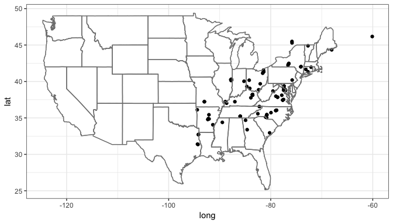

[

Quickstart guide
----------------

About
-----

R wrapper for iNaturalist APIs for accessing the observations. The
Detailed documentation of API is available on [iNaturlaist
website](http://www.inaturalist.org/pages/api+reference) and is part of
our larger species occurence searching packages
[SPOCC](http://github.com/ropensci/spocc)

Get observations
----------------

**Searching**

*Fuzzy search*

You can search for observations by either common or latin name. It will
search the entire iNaturalist entry, so the search below will return all
entries that mention Monarch butterflies, not just entries for Monarchs.

    library(rinat)

    butterflies <- get_inat_obs(query = "Monarch Butterfly")

Another use for a fuzzy search is searching for a common name or
habitat, e.g. searching for all observations that might happen in a
vernal pool. We can then see all the species names found.

    vp_obs <- get_inat_obs(query = "vernal pool")
    head(vp_obs$species_guess)

    ## [1] "Eastern Hemlock"         ""                       
    ## [3] "Longtail Tadpole Shrimp" "Great Blue Skimmer"     
    ## [5] "Wood Frog"               ""

*Taxon query* To return only records for a specific species or taxonomic
group, use the taxon option.

    ## Return just observations in the family Plecoptera
    stone_flies <- get_inat_obs(taxon_name  = "Plecoptera", year = 2010)

    ## Return just Monarch Butterfly records
    just_butterflies <- get_inat_obs(taxon_name = "Danaus plexippus")

*Bounding box search*

You can also search within a bounding box by giving a simple set of
coordinates.

    ## Search by area

    bounds <- c(38.44047, -125, 40.86652, -121.837)
    deer <- get_inat_obs(query = "Mule Deer", bounds = bounds)

**Other functions**

*Get information and observations by project*

You can get all the observations for a project if you know it's ID or
name as an intaturalist slug

    ## Just get info about a project
    vt_crows <- get_inat_obs_project("crows-in-vermont", type = "info", raw = FALSE)

    ## 137  Records
    ## 0

    ## Now get all the observations for that project
    vt_crows_obs <- get_inat_obs_project(vt_crows$id, type = "observations")

    ## 137  Records
    ## 0-100-200

*Get observation details*

Detailed information about a specific observation can be retrieved by
observation ID. The easiest way to get the ID is from a more general
search.

    m_obs <- get_inat_obs(query = "Monarch Butterfly")
    head(get_inat_obs_id(m_obs$id[1]))

    ## $id
    ## [1] 5209229
    ## 
    ## $observed_on
    ## [1] "2016-12-12"
    ## 
    ## $description
    ## NULL
    ## 
    ## $latitude
    ## [1] "-42.9071542023"
    ## 
    ## $longitude
    ## [1] "172.6419067383"
    ## 
    ## $map_scale
    ## NULL

*Get all observations by user*

If you just want all the observations by a user you can download all
their observations by user ID. A word of warning though, this can be
quite large (easily into the 1000's)

    m_obs <- get_inat_obs(query = "Monarch Butterfly")
    head(get_inat_obs_user(as.character(m_obs$user_login[1]), maxresults = 20))[,1:5]

    ##    scientific_name                  datetime
    ## 1     Vanessa itea 2016-12-12 12:33:00 +1300
    ## 2 Danaus plexippus 2016-12-12 12:30:00 +1300
    ## 3 Danaus plexippus 2016-12-12 11:53:00 +1300
    ## 4 Danaus plexippus 2016-12-12 11:52:00 +1300
    ## 5 Danaus plexippus 2016-12-12 11:41:00 +1300
    ## 6 Danaus plexippus 2016-12-12 11:43:00 +1300
    ##                                             description
    ## 1                                                      
    ## 2                                                      
    ## 3                                                      
    ## 4                                                      
    ## 5                                                      
    ## 6 This Monarch appears to have slightly deformed wings.
    ##             place_guess  latitude
    ## 1 Hawarden, New Zealand -42.90615
    ## 2 Hawarden, New Zealand -42.90715
    ## 3 Hawarden, New Zealand -42.91621
    ## 4 Hawarden, New Zealand -42.90816
    ## 5 Hawarden, New Zealand -42.91319
    ## 6                              NA

*Stats by taxa*

Basic statistics are available for taxa counts by date, date range,
place ID (numeric ID), or user ID (string)

    ## By date
    counts <- get_inat_taxon_stats(date = "2010-06-14")
    print(counts$total)

    ## [1] 120

    print(counts$species_counts[1:5,])

    ##   count taxon.id            taxon.name taxon.rank taxon.rank_level
    ## 1     5    57495       Melitaea cinxia    species               10
    ## 2     2    17008       Sayornis phoebe    species               10
    ## 3     2    52589 Coenonympha pamphilus    species               10
    ## 4     2    55908         Lepus timidus    species               10
    ## 5     2    56057  Leucanthemum vulgare    species               10
    ##   taxon.default_name.id taxon.default_name.name
    ## 1                 91278    Glanville Fritillary
    ## 2                 20369          Eastern Phoebe
    ## 3                114753             Small Heath
    ## 4                 88688           Mountain Hare
    ## 5                 89055            Ox-eye Daisy
    ##   taxon.default_name.is_valid taxon.default_name.lexicon
    ## 1                        TRUE                    English
    ## 2                        TRUE                    English
    ## 3                        TRUE                    English
    ## 4                        TRUE                    English
    ## 5                        TRUE                    English
    ##   taxon.default_name.taxon_id taxon.default_name.created_at
    ## 1                       57495 2010-03-17T07:57:02.000+01:00
    ## 2                       17008 2008-03-13T04:33:20.000+01:00
    ## 3                       52589 2011-05-05T21:50:31.000+02:00
    ## 4                       55908 2010-02-11T17:05:42.000+01:00
    ## 5                       56057 2010-02-16T22:05:51.000+01:00
    ##   taxon.default_name.updated_at taxon.default_name.position
    ## 1 2010-03-17T07:57:02.000+01:00                           0
    ## 2 2008-03-13T04:33:20.000+01:00                           0
    ## 3 2011-05-05T21:50:31.000+02:00                           0
    ## 4 2010-02-11T17:05:42.000+01:00                           0
    ## 5 2017-01-05T00:57:29.655+01:00                           0
    ##                                                     taxon.image_url
    ## 1   https://farm6.staticflickr.com/5206/5309980832_01c907d2f9_s.jpg
    ## 2   https://farm6.staticflickr.com/5009/5346970195_d0eac9966b_s.jpg
    ## 3   https://farm5.staticflickr.com/4005/4624300321_d1a46ff97e_s.jpg
    ## 4  https://farm6.staticflickr.com/5483/11718223795_b05531bbf6_s.jpg
    ## 5 https://static.inaturalist.org/photos/10419/square.jpg?1444278709
    ##   taxon.iconic_taxon_name taxon.conservation_status_name
    ## 1                 Insecta                           <NA>
    ## 2                    Aves                  least_concern
    ## 3                 Insecta                           <NA>
    ## 4                Mammalia                  least_concern
    ## 5                 Plantae                           <NA>

    print(counts$rank_counts)

    ## $species
    ## [1] 102
    ## 
    ## $genus
    ## [1] 8
    ## 
    ## $subspecies
    ## [1] 4
    ## 
    ## $family
    ## [1] 2
    ## 
    ## $variety
    ## [1] 2
    ## 
    ## $order
    ## [1] 1
    ## 
    ## $phylum
    ## [1] 1

*Stats by user*

Similar statistics can be gotten for users. The same input parameters
can be used, but results are the top five users by species count and
observation count.

    ## By date
    counts <- get_inat_user_stats(date = "2010-06-14")
    print(counts$total)

    ## [1] 61

    print(counts$most_observations[1:10,])

    ##    count user.id            user.login        user.name
    ## 1     12  357375           richardling     Richard Ling
    ## 2     10    9706            greglasley      Greg Lasley
    ## 3      8  109098 leannewallisbiologist                 
    ## 4      8  362446              pwdeacon                 
    ## 5      7  317332        mortenddhansen Morten DD Hansen
    ## 6      4     357             annetanne                 
    ## 7      4    3499               bryanto                 
    ## 8      4   10285               finatic        BJ Stacey
    ## 9      3     382               tsoleau                 
    ## 10     3     873              tapbirds        Scott Cox
    ##                                                                     user.user_icon_url
    ## 1   https://static.inaturalist.org/attachments/users/icons/357375/thumb.jpg?1484462740
    ## 2     https://static.inaturalist.org/attachments/users/icons/9706/thumb.jpg?1475532223
    ## 3   https://static.inaturalist.org/attachments/users/icons/109098/thumb.jpg?1475547611
    ## 4   https://static.inaturalist.org/attachments/users/icons/362446/thumb.jpg?1478142809
    ## 5  https://static.inaturalist.org/attachments/users/icons/317332/thumb.jpeg?1475532800
    ## 6      https://static.inaturalist.org/attachments/users/icons/357/thumb.jpg?1475527524
    ## 7     https://static.inaturalist.org/attachments/users/icons/3499/thumb.jpg?1475528879
    ## 8    https://static.inaturalist.org/attachments/users/icons/10285/thumb.jpg?1475532519
    ## 9      https://static.inaturalist.org/attachments/users/icons/382/thumb.jpg?1475527539
    ## 10     https://static.inaturalist.org/attachments/users/icons/873/thumb.jpg?1475527722

    print(counts$most_species[1:10,])

    ##    count user.id            user.login    user.name
    ## 1     10    9706            greglasley  Greg Lasley
    ## 2     10  357375           richardling Richard Ling
    ## 3      8  362446              pwdeacon             
    ## 4      7  109098 leannewallisbiologist             
    ## 5      4   10285               finatic    BJ Stacey
    ## 6      3     382               tsoleau             
    ## 7      3    3403                davidr      David R
    ## 8      3    3499               bryanto             
    ## 9      3   18056              plantman         <NA>
    ## 10     3   38530           kevinhintsa             
    ##                                                                    user.user_icon_url
    ## 1    https://static.inaturalist.org/attachments/users/icons/9706/thumb.jpg?1475532223
    ## 2  https://static.inaturalist.org/attachments/users/icons/357375/thumb.jpg?1484462740
    ## 3  https://static.inaturalist.org/attachments/users/icons/362446/thumb.jpg?1478142809
    ## 4  https://static.inaturalist.org/attachments/users/icons/109098/thumb.jpg?1475547611
    ## 5   https://static.inaturalist.org/attachments/users/icons/10285/thumb.jpg?1475532519
    ## 6     https://static.inaturalist.org/attachments/users/icons/382/thumb.jpg?1475527539
    ## 7    https://static.inaturalist.org/attachments/users/icons/3403/thumb.jpg?1475528831
    ## 8    https://static.inaturalist.org/attachments/users/icons/3499/thumb.jpg?1475528879
    ## 9                                                                                <NA>
    ## 10  https://static.inaturalist.org/attachments/users/icons/38530/thumb.jpg?1475547495

    ## By place_ID
    vt_crows <- get_inat_obs_project("crows-in-vermont", type = "info", raw = FALSE)

    ## 137  Records
    ## 0

    place_counts <- get_inat_user_stats(place = vt_crows$place_id)
    print(place_counts$total)

    ## [1] 1421

    print(place_counts$most_observations[1:10,])

    ##    count user.id    user.login      user.name
    ## 1  18329   12158 erikamitchell Erika Mitchell
    ## 2  15800    2179       charlie   Charlie Hohn
    ## 3   8046   12610  susanelliott  Susan Elliott
    ## 4   5924   12036       zaccota       Zac Cota
    ## 5   4388   11792     kylejones     Kyle Jones
    ## 6   4324   12045      larry522 Larry Clarfeld
    ## 7   4308     317   kpmcfarland Kent McFarland
    ## 8   3835   28921         rwp84    roy pilcher
    ## 9   3065   18303   marvelliott   Marv Elliott
    ## 10  2761   12049 gaudettelaura Laura Gaudette
    ##                                                                    user.user_icon_url
    ## 1  https://static.inaturalist.org/attachments/users/icons/12158/thumb.jpeg?1475533280
    ## 2    https://static.inaturalist.org/attachments/users/icons/2179/thumb.jpg?1475528361
    ## 3   https://static.inaturalist.org/attachments/users/icons/12610/thumb.jpg?1475533475
    ## 4   https://static.inaturalist.org/attachments/users/icons/12036/thumb.jpg?1475533232
    ## 5   https://static.inaturalist.org/attachments/users/icons/11792/thumb.jpg?1475533125
    ## 6   https://static.inaturalist.org/attachments/users/icons/12045/thumb.jpg?1475533238
    ## 7     https://static.inaturalist.org/attachments/users/icons/317/thumb.jpg?1475527502
    ## 8   https://static.inaturalist.org/attachments/users/icons/28921/thumb.jpg?1475542431
    ## 9   https://static.inaturalist.org/attachments/users/icons/18303/thumb.jpg?1475537232
    ## 10  https://static.inaturalist.org/attachments/users/icons/12049/thumb.jpg?1475533241

    print(place_counts$most_species[1:10,])

    ##    count user.id    user.login      user.name
    ## 1   1869   12158 erikamitchell Erika Mitchell
    ## 2   1833   12610  susanelliott  Susan Elliott
    ## 3   1677   12045      larry522 Larry Clarfeld
    ## 4   1350   11792     kylejones     Kyle Jones
    ## 5   1235    2179       charlie   Charlie Hohn
    ## 6   1108    6624   joannerusso               
    ## 7   1062     317   kpmcfarland Kent McFarland
    ## 8    998   12049 gaudettelaura Laura Gaudette
    ## 9    833    3847        rpayne      Ron Payne
    ## 10   793   28921         rwp84    roy pilcher
    ##                                                                    user.user_icon_url
    ## 1  https://static.inaturalist.org/attachments/users/icons/12158/thumb.jpeg?1475533280
    ## 2   https://static.inaturalist.org/attachments/users/icons/12610/thumb.jpg?1475533475
    ## 3   https://static.inaturalist.org/attachments/users/icons/12045/thumb.jpg?1475533238
    ## 4   https://static.inaturalist.org/attachments/users/icons/11792/thumb.jpg?1475533125
    ## 5    https://static.inaturalist.org/attachments/users/icons/2179/thumb.jpg?1475528361
    ## 6    https://static.inaturalist.org/attachments/users/icons/6624/thumb.jpg?1475530731
    ## 7     https://static.inaturalist.org/attachments/users/icons/317/thumb.jpg?1475527502
    ## 8   https://static.inaturalist.org/attachments/users/icons/12049/thumb.jpg?1475533241
    ## 9    https://static.inaturalist.org/attachments/users/icons/3847/thumb.jpg?1475529084
    ## 10  https://static.inaturalist.org/attachments/users/icons/28921/thumb.jpg?1475542431

Mapping.
--------

Basic maps can be created as well to quickly visualize search results.
Maps can either be plotted automatically `plot = TRUE` or simply return
a ggplot2 object with `plot = FALSE`. This works well with single
species data, but more complicated plots are best made from scratch.

    library(ggplot2)

    ## Map salamanders in the genuse Ambystoma
    m_obs <- get_inat_obs(taxon_name = "Ambystoma maculatum")

    salamander_map <- inat_map(m_obs, plot = FALSE)
    ### Now we can modify the returned map
    salamander_map + borders("state") + theme_bw()

    ## Warning: Removed 2 rows containing missing values (geom_point).

