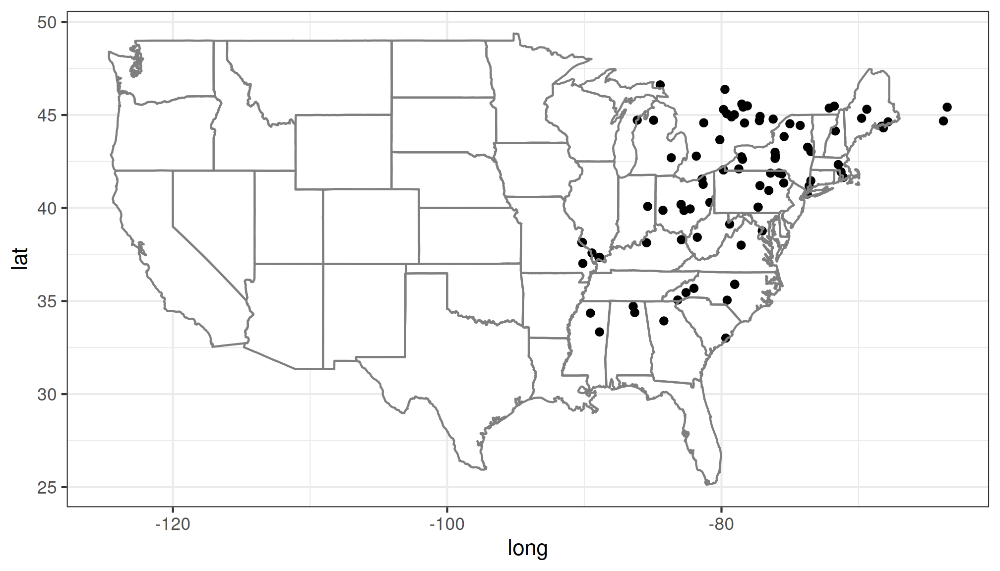
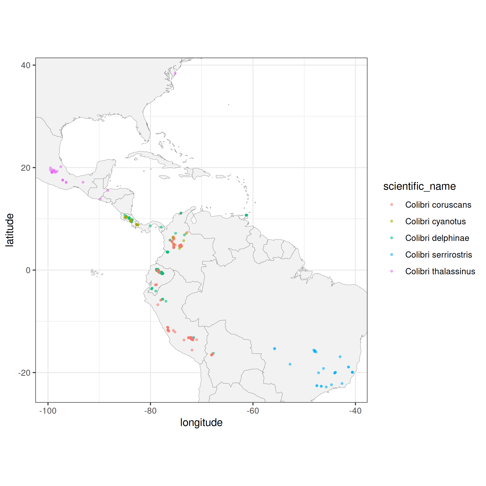

rinat: Access iNaturalist data with R
================
Edmund Hart, Stéphane Guillou

[](https://travis-ci.org/ropensci/rinat)
[](https://ci.appveyor.com/project/sckott/rinat/branch/master)
[](https://codecov.io/github/ropensci/rinat?branch=master)
[](https://CRAN.R-project.org/package=rinat)

R wrapper for iNaturalist APIs for accessing the observations. The
detailed documentation of the API is available on the [iNaturalist
website](https://www.inaturalist.org/pages/api+reference) and is part of
our larger species occurrence searching packages
[SPOCC](https://github.com/ropensci/spocc).

## Installation

You can install the latest version available on CRAN with:

``` r
install.packages("rinat")
```

Alternatively, you can install the development version from Github with:

``` r
remotes::install_github("ropensci/rinat")
```

## Usage

### Get observations

`get_inat_obs()` is the primary function that retrieves observations
from iNaturalist. The text or taxon search can be refined by observation
date, record quality and location.

> It is recommended to set the `quality` argument to `"research"` in
> order to get more reliable data that has been validated by several
> contributors.

#### Taxon search

To return only records of a specific species or taxonomic group, use the
`taxon_name` argument. For example, to return observations of anything
from the Nymphalidae family, and restricting the search to the year
2015:

``` r
library(rinat)
nymphalidae <- get_inat_obs(taxon_name  = "Nymphalidae", year = 2015)
# how many unique taxa?
length(unique(nymphalidae$scientific_name))
```

    ## [1] 72

> Note that `get_inat_obs()` will return 100 observations by default.
> This can be controlled with the `maxresults` argument.

#### Text search

You can also search observations with any string. It will search the
entire iNaturalist database, so the search below will return all entries
that *mention* Monarch butterflies, not just Monarch observations.

``` r
monarchs <- get_inat_obs(query = "Monarch Butterfly", year = 2021)
# which taxa were returned?
unique(monarchs$scientific_name)
```

    ## [1] "Danaus plexippus" "Danaina"

You can combine the fuzzy search with the precise taxon search. For
example, to get Monarch butterfly observations that also mention the
term “chrysalis”:

``` r
monarch_chrysalis <- get_inat_obs(taxon_name = "Danaus plexippus", query = "chrysalis")
```

#### Bounding box search

You can also search within a bounding box by giving a simple set of
coordinates.

``` r
## Search by area
bounds <- c(38.44047, -125, 40.86652, -121.837)
deer <- get_inat_obs(query = "Mule Deer", bounds = bounds)
plot(deer$longitude, deer$latitude)
```

<!-- -->

### Other functions

More functions are available, notably to access:

-   observations in a project with `get_inat_obs_project()`
-   details of a single observation with `get_inat_obs_id()`
-   observations from a single user with `get_inat_obs_user()`
-   taxa statistics with `get_inat_taxon_stats()`
-   user statistics with `get_inat_user_stats()`

More detailed examples are included in the vignette:

``` r
vignette("rinat-intro", package = "rinat")
```

#### Mapping

Basic maps can be created with the `inat_map()` function to quickly
visualize search results. The `plot = FALSE` option can be used to avoid
displaying the initial plot when further customising it with ggplot2
functions.

``` r
library(ggplot2)

## Map 100 spotted salamanders
a_mac <- get_inat_obs(taxon_name = "Ambystoma maculatum", year = 2021)
salamander_map <- inat_map(a_mac, plot = FALSE)

### Further customise the returned ggplot object
salamander_map + borders("state") + theme_bw()
```



`inat_map()` is useful for quickly mapping single-species data obtained
with rinat. However, more complicated plots are best made from scratch.
Here is an example of customised map that does not make use of it. (Note
the use of `quality = "research"` to restrict the search to the more
reliable observations.)

``` r
## A more elaborate map of Colibri sp.
colibri <- get_inat_obs(taxon_name = "Colibri",
                        quality = "research",
                        maxresults = 500)
ggplot(data = colibri, aes(x = longitude,
                         y = latitude,
                         colour = scientific_name)) +
  geom_polygon(data = map_data("world"),
                   aes(x = long, y = lat, group = group),
                   fill = "grey95",
                   color = "gray40",
                   size = 0.1) +
  geom_point(size = 0.7, alpha = 0.5) +
  coord_fixed(xlim = range(colibri$longitude, na.rm = TRUE),
              ylim = range(colibri$latitude, na.rm = TRUE)) +
  theme_bw()
```



------------------------------------------------------------------------

[](https://ropensci.org/)
