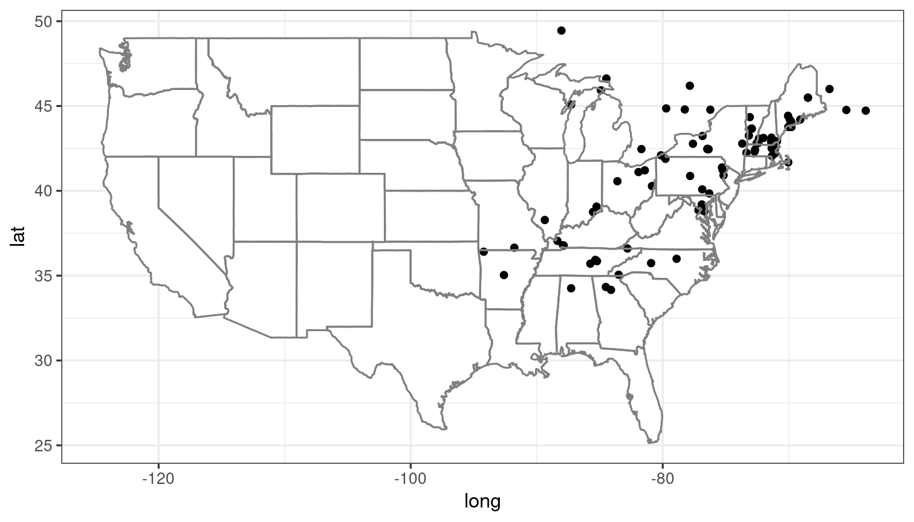
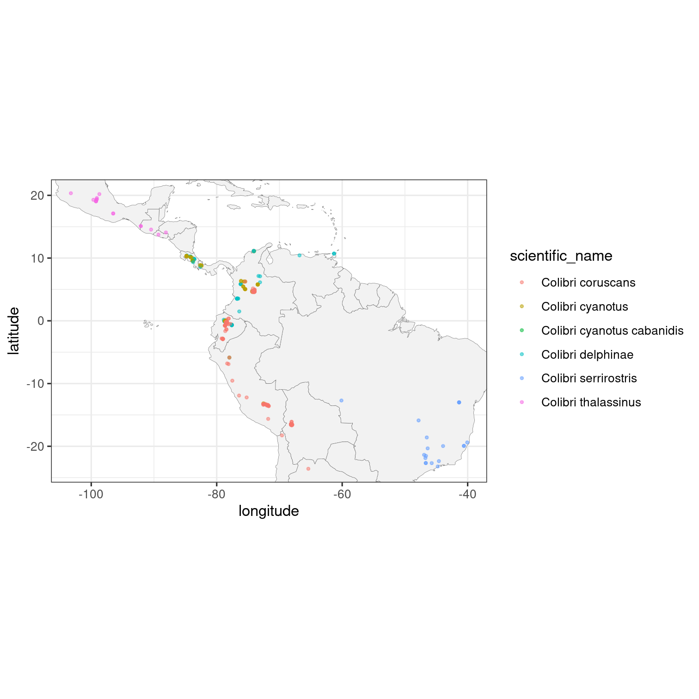

## About

rinat is a wrapper for iNaturalist APIs for accessing the observations. The detailed documentation of the API is available on the [iNaturalist website](https://www.inaturalist.org/pages/api+reference) and is part of our larger species occurrence searching packages [SPOCC](https://github.com/ropensci/spocc).


## Quickstart guide

### Get observations

`get_inat_obs()` is the primary function that retrieves observations from iNaturalist. The text or taxon search can be refined by observation date, record quality and location.

> It is recommended to set the `quality` argument to `"research"` in order to get more reliable data that has been validated by several contributors.

#### Fuzzy search

You can search for observations by either common or scientific name. It will search the entire iNaturalist database, so the search below will return entries that _mention_ Monarch butterflies, not just Monarch observations.


```r
library(rinat)
monarchs <- get_inat_obs(query = "Monarch Butterfly", year = 2021)
unique(monarchs$scientific_name)
#> [1] "Danaus plexippus" "Danaina"
```

> Note that `get_inat_obs()` will return 100 observations by default. This can be controlled with the `maxresults` argument.

Another use for a fuzzy search is searching for a habitat, e.g. searching for all observations that might happen in a [vernal pool](https://en.wikipedia.org/wiki/Vernal_pool). We can then explore the taxon names found.


```r
vp_obs <- get_inat_obs(query = "vernal pool")
# see the first few taxa
head(unique(vp_obs$scientific_name))
#> [1] "Calanoida"           "Scapholeberis"       "Naididae"            "Paramecium"         
#> [5] "Ambystoma maculatum" "Cyclopidae"
```


#### Taxon search

To return only records of a specific species or taxonomic group, use the `taxon_name` argument. For example, to return observations of anything from the Nymphalidae family, and restricting the search to the year 2015:


```r
nymphalidae <- get_inat_obs(taxon_name  = "Nymphalidae", year = 2015)
# how many unique taxa?
length(unique(nymphalidae$scientific_name))
#> [1] 79
```

And to return only the Monarch butterfly observations that also mention the term "chrysalis":


```r
monarch_chrysalis <- get_inat_obs(taxon_name = "Danaus plexippus", query = "chrysalis")
```


#### Bounding box search

You can also search within a bounding box by giving a simple set of coordinates.


```r
## Search by area
bounds <- c(38.44047, -125, 40.86652, -121.837)
deer <- get_inat_obs(query = "Mule Deer", bounds = bounds)
plot(deer$longitude, deer$latitude)
```


### Other functions

#### Get information and observations by project

You can get all the observations for a project if you know its ID or name as an iNaturalist slug.


```r
## Just get info about a project
vt_crows <- get_inat_obs_project("crows-in-vermont", type = "info", raw = FALSE)
#> 206 records
```


```r
## Now get all the observations for that project
vt_crows_obs <- get_inat_obs_project(vt_crows$id, type = "observations")
#> 206 records
#> Getting records 0-200
#> Getting records up to 400
#> Done.
#> Note: mismatch between number of observations reported and returned by the API.
```


#### Get observation details

Detailed information about a specific observation can be retrieved by observation ID. The easiest way to get the ID is from a previous search for that taxon.


```r
head(get_inat_obs_id(monarch_chrysalis$id[1]))
#> $id
#> [1] 121193310
#> 
#> $observed_on
#> [1] "2022-06-09"
#> 
#> $description
#> [1] "Hatched on 5/21, formed J and chrysalis both on 6/9 within about 12 hours, host was Asclepias syriaca"
#> 
#> $latitude
#> [1] "38.6252520294"
#> 
#> $longitude
#> [1] "-90.3803088003"
#> 
#> $map_scale
#> NULL
```


#### Get all observations by user

If you just want all the observations by a user you can download all their observations by user ID. A word of warning though, this can be quite large (easily into the 1000's).


```r
user_obs <- get_inat_obs_user(monarch_chrysalis$user_login[1], maxresults = 20)
head(user_obs)[,1:5]
#>         scientific_name                  datetime
#> 1      Danaus plexippus 2022-06-09 09:50:22 -0500
#> 2       Gymnosporangium 2022-06-09 16:18:57 -0500
#> 3         Araneomorphae 2022-06-09 10:39:55 -0500
#> 4 Chrysopilus velutinus 2022-06-09 10:39:49 -0500
#> 5        Lethe anthedon 2022-06-09 10:44:07 -0500
#> 6               Tigrosa 2022-06-09 12:15:58 -0500
#>                                                                                                      description
#> 1          Hatched on 5/21, formed J and chrysalis both on 6/9 within about 12 hours, host was Asclepias syriaca
#> 2                                                                            Host plant is Amelanchier arborea. 
#> 3 Unknown spider species hiding in the stem/node leafy appendages on tulip tree eating a Chrysopilus velutinus. 
#> 4              Being eaten by an unknown spider species hiding in the stem/node leafy appendages on tulip tree. 
#> 5                                                                                                               
#> 6                                                                Under a rock at the very edge of an urban creek
#>                    place_guess latitude
#> 1 Litzsinger Rd, Ladue, MO, US 38.62525
#> 2 Litzsinger Rd, Ladue, MO, US 38.62386
#> 3                Ladue, MO, US 38.62476
#> 4                Ladue, MO, US 38.62476
#> 5 Litzsinger Rd, Ladue, MO, US 38.62391
#> 6                Ladue, MO, US 38.62664
```


#### Stats by taxa

Basic statistics are available for taxa counts by date, date range, place ID (numeric ID), or user ID (string). Only the top 5 species are listed.


```r
## By date
counts <- get_inat_taxon_stats(date = "2020-06-14")
counts$total
#> [1] 25758
### Top 5 species
counts$species_counts
#>   count taxon.id           taxon.name taxon.rank taxon.rank_level taxon.default_name.id
#> 1   380    48484    Harmonia axyridis    species               10                 89147
#> 2   332    56057 Leucanthemum vulgare    species               10                924783
#> 3   330    52821 Achillea millefolium    species               10                942097
#> 4   319    51875   Trifolium pratense    species               10                942055
#> 5   303    55745     Trifolium repens    species               10                943715
#>   taxon.default_name.name taxon.default_name.is_valid taxon.default_name.lexicon
#> 1       Asian Lady Beetle                        TRUE                    English
#> 2             oxeye daisy                        TRUE                    English
#> 3           Common Yarrow                        TRUE                    English
#> 4              red clover                        TRUE                    English
#> 5            white clover                        TRUE                    English
#>                                                             taxon.image_url taxon.iconic_taxon_name
#> 1                 https://static.inaturalist.org/photos/30978499/square.jpg                 Insecta
#> 2 https://inaturalist-open-data.s3.amazonaws.com/photos/71002344/square.jpg                 Plantae
#> 3     https://inaturalist-open-data.s3.amazonaws.com/photos/4902/square.jpg                 Plantae
#> 4                 https://static.inaturalist.org/photos/38032773/square.jpg                 Plantae
#> 5 https://inaturalist-open-data.s3.amazonaws.com/photos/86716150/square.jpg                 Plantae
#>   taxon.conservation_status_name
#> 1                           <NA>
#> 2                           <NA>
#> 3                  least_concern
#> 4                  least_concern
#> 5                           <NA>
### Most common taxon ranks
counts$rank_counts
#> $species
#> [1] 18883
#> 
#> $genus
#> [1] 3645
#> 
#> $subspecies
#> [1] 758
#> 
#> $family
#> [1] 611
#> 
#> $subfamily
#> [1] 373
#> 
#> $tribe
#> [1] 338
#> 
#> $variety
#> [1] 233
#> 
#> $subgenus
#> [1] 158
#> 
#> $order
#> [1] 120
#> 
#> $hybrid
#> [1] 95
#> 
#> $superfamily
#> [1] 85
#> 
#> $section
#> [1] 83
#> 
#> $subtribe
#> [1] 80
#> 
#> $complex
#> [1] 76
#> 
#> $class
#> [1] 39
#> 
#> $suborder
#> [1] 39
#> 
#> $infraorder
#> [1] 29
#> 
#> $phylum
#> [1] 22
#> 
#> $subclass
#> [1] 20
#> 
#> $form
#> [1] 12
#> 
#> $subsection
#> [1] 9
#> 
#> $subphylum
#> [1] 8
#> 
#> $infraclass
#> [1] 6
#> 
#> $kingdom
#> [1] 5
#> 
#> $superorder
#> [1] 4
#> 
#> $genushybrid
#> [1] 3
#> 
#> $zoosection
#> [1] 3
#> 
#> $epifamily
#> [1] 2
#> 
#> $subterclass
#> [1] 2
#> 
#> $zoosubsection
#> [1] 2
```


#### Stats by user

Similar statistics can be gotten for users. The same input parameters can be used.


```r
## By date
counts <- get_inat_user_stats(date = "2010-06-14")
counts$total
#> [1] 341
counts$most_observations[1:10,]
#>    count user.id      user.login       user.name
#> 1    129  245282  hughmcguinness Hugh McGuinness
#> 2     53  811118     sandbankspp                
#> 3     50 3334393 koniakin_serhii Serhii Koniakin
#> 4     34  541847      billhubick     Bill Hubick
#> 5     31    6930       tgosliner  Terry Gosliner
#> 6     31 2883853      linkmdavis      Link Davis
#> 7     30   46945             abe    T. Abe Lloyd
#> 8     26  280446         mtjones      Mike Jones
#> 9     25  761669 kathleenfspicer            <NA>
#> 10    21    2616     alice_abela     Alice Abela
#>                                                                     user.user_icon_url
#> 1   https://static.inaturalist.org/attachments/users/icons/245282/thumb.jpg?1475532481
#> 2  https://static.inaturalist.org/attachments/users/icons/811118/thumb.jpeg?1535236899
#> 3  https://static.inaturalist.org/attachments/users/icons/3334393/thumb.jpg?1650572950
#> 4   https://static.inaturalist.org/attachments/users/icons/541847/thumb.jpg?1582771190
#> 5     https://static.inaturalist.org/attachments/users/icons/6930/thumb.jpg?1475530872
#> 6  https://static.inaturalist.org/attachments/users/icons/2883853/thumb.jpg?1647293664
#> 7    https://static.inaturalist.org/attachments/users/icons/46945/thumb.jpg?1624289207
#> 8   https://static.inaturalist.org/attachments/users/icons/280446/thumb.jpg?1635600681
#> 9                                                                                 <NA>
#> 10    https://static.inaturalist.org/attachments/users/icons/2616/thumb.jpg?1475528533
counts$most_species[1:10,]
#>    count user.id      user.login           user.name
#> 1     89  245282  hughmcguinness     Hugh McGuinness
#> 2     47  811118     sandbankspp                    
#> 3     36 3334393 koniakin_serhii     Serhii Koniakin
#> 4     25    6930       tgosliner      Terry Gosliner
#> 5     24   46945             abe        T. Abe Lloyd
#> 6     24  761669 kathleenfspicer                <NA>
#> 7     17    2616     alice_abela         Alice Abela
#> 8     17  495266        maxa11an Max Allan Niklasson
#> 9     17  541847      billhubick         Bill Hubick
#> 10    15  280446         mtjones          Mike Jones
#>                                                                     user.user_icon_url
#> 1   https://static.inaturalist.org/attachments/users/icons/245282/thumb.jpg?1475532481
#> 2  https://static.inaturalist.org/attachments/users/icons/811118/thumb.jpeg?1535236899
#> 3  https://static.inaturalist.org/attachments/users/icons/3334393/thumb.jpg?1650572950
#> 4     https://static.inaturalist.org/attachments/users/icons/6930/thumb.jpg?1475530872
#> 5    https://static.inaturalist.org/attachments/users/icons/46945/thumb.jpg?1624289207
#> 6                                                                                 <NA>
#> 7     https://static.inaturalist.org/attachments/users/icons/2616/thumb.jpg?1475528533
#> 8  https://static.inaturalist.org/attachments/users/icons/495266/thumb.jpeg?1579782546
#> 9   https://static.inaturalist.org/attachments/users/icons/541847/thumb.jpg?1582771190
#> 10  https://static.inaturalist.org/attachments/users/icons/280446/thumb.jpg?1635600681
```


```r
## By place_ID
vt_crows <- get_inat_obs_project("crows-in-vermont", type = "info", raw = FALSE)
#> 206 records
place_counts <- get_inat_user_stats(place = vt_crows$place_id)
place_counts$total
#> [1] 19054
place_counts$most_observations[1:10,]
#>    count user.id    user.login       user.name
#> 1  89422   12158 erikamitchell  Erika Mitchell
#> 2  41518    2179       charlie    Charlie Hohn
#> 3  21049   12610  susanelliott   Susan Elliott
#> 4  12339   20198 joshualincoln  Joshua Lincoln
#> 5  11977   12045      larry522  Larry Clarfeld
#> 6  11842 1168695       trscavo       Tom Scavo
#> 7  10893  171529        nsharp Nathaniel Sharp
#> 8  10826    6624   joannerusso                
#> 9  10444  108365     judywelna                
#> 10  9900     317   kpmcfarland  Kent McFarland
#>                                                                     user.user_icon_url
#> 1    https://static.inaturalist.org/attachments/users/icons/12158/thumb.jpg?1586465563
#> 2     https://static.inaturalist.org/attachments/users/icons/2179/thumb.jpg?1569109298
#> 3    https://static.inaturalist.org/attachments/users/icons/12610/thumb.jpg?1475533475
#> 4    https://static.inaturalist.org/attachments/users/icons/20198/thumb.jpg?1475538276
#> 5    https://static.inaturalist.org/attachments/users/icons/12045/thumb.jpg?1475533238
#> 6  https://static.inaturalist.org/attachments/users/icons/1168695/thumb.png?1535480090
#> 7   https://static.inaturalist.org/attachments/users/icons/171529/thumb.jpg?1544399969
#> 8     https://static.inaturalist.org/attachments/users/icons/6624/thumb.jpg?1639690628
#> 9   https://static.inaturalist.org/attachments/users/icons/108365/thumb.jpg?1475547470
#> 10     https://static.inaturalist.org/attachments/users/icons/317/thumb.png?1634743248
place_counts$most_species[1:10,]
#>    count user.id    user.login       user.name
#> 1   3561   12158 erikamitchell  Erika Mitchell
#> 2   2465   12610  susanelliott   Susan Elliott
#> 3   2389   12045      larry522  Larry Clarfeld
#> 4   2033    2179       charlie    Charlie Hohn
#> 5   1926   13355        beeboy   Spencer Hardy
#> 6   1877    6624   joannerusso                
#> 7   1854  171529        nsharp Nathaniel Sharp
#> 8   1830   20198 joshualincoln  Joshua Lincoln
#> 9   1752 2860446      er-birds                
#> 10  1550     317   kpmcfarland  Kent McFarland
#>                                                                     user.user_icon_url
#> 1    https://static.inaturalist.org/attachments/users/icons/12158/thumb.jpg?1586465563
#> 2    https://static.inaturalist.org/attachments/users/icons/12610/thumb.jpg?1475533475
#> 3    https://static.inaturalist.org/attachments/users/icons/12045/thumb.jpg?1475533238
#> 4     https://static.inaturalist.org/attachments/users/icons/2179/thumb.jpg?1569109298
#> 5    https://static.inaturalist.org/attachments/users/icons/13355/thumb.jpg?1475533838
#> 6     https://static.inaturalist.org/attachments/users/icons/6624/thumb.jpg?1639690628
#> 7   https://static.inaturalist.org/attachments/users/icons/171529/thumb.jpg?1544399969
#> 8    https://static.inaturalist.org/attachments/users/icons/20198/thumb.jpg?1475538276
#> 9  https://static.inaturalist.org/attachments/users/icons/2860446/thumb.jpg?1588019864
#> 10     https://static.inaturalist.org/attachments/users/icons/317/thumb.png?1634743248
```


### Mapping

Basic maps can be created with the `inat_map()` function to quickly visualize search results. The `plot = FALSE` option can be used to avoid displaying the initial plot when further customising it with ggplot2 functions.


```r
library(ggplot2)

## Map 100 spotted salamanders
a_mac <- get_inat_obs(taxon_name = "Ambystoma maculatum", year = 2021)
salamander_map <- inat_map(a_mac, plot = FALSE)

### Further customise the returned ggplot object
salamander_map + borders("state") + theme_bw()
```



`inat_map()` is useful for quickly mapping single-species data obtained with rinat. However, more complicated plots are best made from scratch. Here is an example of customised map that does not make use of it. (Note the use of `quality = "research"` to restrict the search to the more reliable observations.)


```r
## A more elaborate map of Colibri sp.
colibri <- get_inat_obs(taxon_name = "Colibri",
                        quality = "research",
                        maxresults = 500)
ggplot(data = colibri, aes(x = longitude,
                         y = latitude,
                         colour = scientific_name)) +
  geom_polygon(data = map_data("world"),
                   aes(x = long, y = lat, group = group),
                   fill = "grey95",
                   color = "gray40",
                   size = 0.1) +
  geom_point(size = 0.7, alpha = 0.5) +
  coord_fixed(xlim = range(colibri$longitude, na.rm = TRUE),
              ylim = range(colibri$latitude, na.rm = TRUE)) +
  theme_bw()
```



