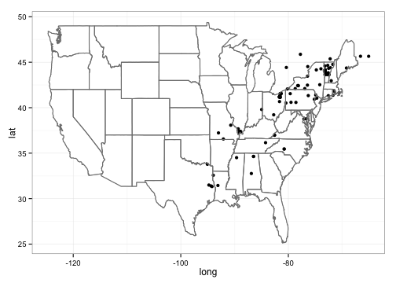

---
title: "Access iNaturalist data through APIs"
author: "Edmund Hart"
date: "2017-02-27"
output: rmarkdown::html_vignette
vignette: >
  %\VignetteIndexEntry{Access iNaturalist data through APIs}
  %\VignetteEngine{knitr::rmarkdown}
  %\VignetteEncoding{UTF-8}
---

## Quickstart guide
 
 
## About
R wrapper for iNaturalist APIs for accessing the observations. The Detailed documentation of API is available on [iNaturlaist website](http://www.inaturalist.org/pages/api+reference) and is part of our larger species occurence searching packages [SPOCC](http://github.com/ropensci/spocc)


## Install

Install the development version using `install_github` within Hadley's [devtools](https://github.com/hadley/devtools) package.


```r
install.packages("devtools")
require(devtools)

install_github("rinat", "ropensci")
library(rinat)

```


## Get observations

__Searching__

_Fuzzy search_

You can search for observations by either common or latin name.  It will search the entire iNaturalist entry, so the search below will return all entries that mention Monarch butterflies, not just entries for Monarchs.


```r
butterflies <- get_inat_obs(query = "Monarch Butterfly")
```


Another use for a fuzzy search is searching for a common name or habitat, e.g. searching for all observations that might happen in a vernal pool.  We can then see all the species names found.  

```r
library(rinat)

vp_obs <- get_inat_obs(query = "vernal pool")
head(vp_obs$Species.guess)
```

```
## [1]                              Rails, Gallinules, and Coots
## [3] Western Spadefoot            Western Spadefoot           
## [5] Eupsilia                     upland chorus frog          
## 156 Levels:  Alisma lanceolatum Alisma plantago-aquatica ... Yellow Starthistle (Centaurea solstitialis)
```


_Taxon query_
To return only records for a specific species or taxonomic group, use the taxon option.


```r
## Return just observations in the family Plecoptera
stone_flies <- get_inat_obs(taxon = "Plecoptera")

## Return just Monarch Butterfly records
just_butterflies <- get_inat_obs(taxon = "Danaus plexippus")
```


_Bounding box search_

You can also search within a bounding box by giving a simple set of coordinates.


```r
## Search by area

bounds <- c(38.44047, -125, 40.86652, -121.837)
deer <- get_inat_obs(query = "Mule Deer", bounds = bounds)
```


__Other functions__


_Get information and observations by project_

You can get all the observations for a project if you know it's ID or name as an intaturalist slug


```r
## Just get info about a project
vt_crows <- get_inat_obs_project("crows-in-vermont", type = "info", raw = FALSE)
```

```
## 25  Records
## 0
```

```r
## Now get all the observations for that project
vt_crows_obs <- get_inat_obs_project(vt_crows$id, type = "observations")
```

```
## 25  Records
## 0-100
```


_Get observation details_

Detailed information about a specific observation can be retrieved by observation ID.  The easiest way to get the ID is from a more general search.


```r
m_obs <- get_inat_obs(query = "Monarch Butterfly")
head(get_inat_obs_id(m_obs$Id[1]))
```

```
## $captive
## [1] FALSE
## 
## $comments_count
## [1] 0
## 
## $community_taxon_id
## NULL
## 
## $created_at
## [1] "2014-03-20T13:40:34-03:00"
## 
## $delta
## [1] TRUE
## 
## $description
## [1] "Two individuals flying around in the grassy margin of a large eucalyptus grove, adjacent to a salt marsh. "
```


_Get all observations by user_

If you just want all the observations by a user you can download all their observations by user ID.  A word of warning though, this can be quite large (easily into the 1000's)


```r
m_obs <- get_inat_obs(query = "Monarch Butterfly")
head(get_inat_obs_user(as.character(m_obs$User.login[1]), maxresults = 20))[, 
    1:5]
```

```
##                 Scientific.name                  Datetime
## 1              Danaus plexippus 2014-03-18 15:59:56 +0000
## 2                Taricha torosa 2014-02-26 22:30:00 +0000
## 3      Toxicoscordion fremontii 2014-03-09 14:21:50 +0000
## 4 Coluber lateralis euryxanthus 2014-03-09 14:32:59 +0000
##                                                                                                                                                                                                                                                                                                                                                                                                                                                                 Description
## 1                                                                                                                                                                                                                                                                                                                                                                Two individuals flying around in the grassy margin of a large eucalyptus grove, adjacent to a salt marsh. 
## 2                                                                                                                                                                                                         In the first km along the Nimitz Way paved trail starting from the Inspiration Point parking lot, 109 newts were seen on or immediately next to the trail, between 17:30 and 18:00. It was raining, the ground was wet, with numerous puddles and standing water.
## 3                                                                                                                                                                                                                                                                                                                                                        Growing on a gravel slope below an eroding outcrop of sandstone/mudstone. Site elevation is 270 m above sea level.
## 4 The snake was approximately 50 cm long. It was seen sitting motionless in a bare patch on a east-southeast facing slope, probably warming up. The weather was cloudy and the air temperature was 15 deg C. Elevation at the site was 300 meters above sea level. The immediate vegetation community was chaparral, near the interface with an oak woodland. The sighting was just off a trail, near the crest of a ridgeline with 60% slopes dropping off on either side.
##                               Place.guess Latitude
## 1 Point Pinole Regional Shoreline, CA, US    38.00
## 2            Tilden Regional Park, CA, US    37.91
## 3           Briones Regional Park, CA, US    37.91
## 4           Briones Regional Park, CA, US    37.92
```


_Stats by taxa_

Basic statistics are available for taxa counts by date, date range, place ID (numeric ID), or user ID (string)


```r
## By date
counts <- get_inat_taxon_stats(date = "2010-06-14")
counts
```

```
## $total
## [1] 49
## 
## $species_counts
##   count taxon.id             taxon.name taxon.rank taxon.rank_level
## 1     1    58564        Boloria bellona    species               10
## 2     1    81746   Necrophila americana    species               10
## 3     1    17009          Sayornis saya    species               10
## 4     1    24422 Ptychohyla spinipollex    species               10
## 5     1    11935    Tachycineta bicolor    species               10
##   taxon.default_name.created_at taxon.default_name.creator_id
## 1     2010-04-01T14:12:20-05:00                            NA
## 2     2011-10-22T06:37:44-05:00                          1392
## 3     2008-03-12T22:33:21-05:00                            NA
## 4     2008-03-17T19:43:27-05:00                            NA
## 5     2008-03-12T22:10:45-05:00                            NA
##   taxon.default_name.id taxon.default_name.is_valid
## 1                 92809                        TRUE
## 2                211685                        TRUE
## 3                 20375                        TRUE
## 4                 29116                        TRUE
## 5                 14831                        TRUE
##   taxon.default_name.lexicon taxon.default_name.name
## 1                    English       meadow fritillary
## 2                    English American Carrion Beetle
## 3                    English            Say's Phoebe
## 4           Scientific Names  Ptychohyla spinipollex
## 5                    English            Tree Swallow
##   taxon.default_name.name_provider taxon.default_name.source_id
## 1                 UBioNameProvider                            2
## 2                             <NA>                           NA
## 3                  ColNameProvider                            1
## 4                  ColNameProvider                            1
## 5                  ColNameProvider                            1
##   taxon.default_name.source_identifier
## 1                               839117
## 2                                 <NA>
## 3                               850333
## 4                              3845913
## 5                               850447
##                                                                taxon.default_name.source_url
## 1                                  http://www.ubio.org/browser/details.php?namebankID=839117
## 2                                                                                       <NA>
## 3 http://www.catalogueoflife.org/annual-checklist/show_species_details.php?record_id=1365378
## 4 http://www.catalogueoflife.org/annual-checklist/show_species_details.php?record_id=1569188
## 5 http://www.catalogueoflife.org/annual-checklist/show_species_details.php?record_id=1618023
##   taxon.default_name.taxon_id taxon.default_name.updated_at
## 1                       58564     2010-04-01T14:12:20-05:00
## 2                       81746     2011-10-22T06:37:44-05:00
## 3                       17009     2008-03-12T22:33:21-05:00
## 4                       24422     2008-03-17T19:43:27-05:00
## 5                       11935     2008-03-12T22:10:45-05:00
##   taxon.default_name.updater_id
## 1                            NA
## 2                          1392
## 3                            NA
## 4                            NA
## 5                            NA
##                                                  taxon.image_url
## 1 http://farm4.staticflickr.com/3137/4563715160_60ea310ff4_s.jpg
## 2 http://farm5.staticflickr.com/4013/4658689710_1a534b47ef_s.jpg
## 3 http://farm4.staticflickr.com/3382/3333991507_7fa8dfa600_s.jpg
## 4 http://farm5.staticflickr.com/4093/4769499547_523a426857_s.jpg
## 5   http://farm1.staticflickr.com/177/435466650_1ea6cb197e_s.jpg
##   taxon.iconic_taxon_name taxon.conservation_status_name
## 1                 Insecta                           <NA>
## 2                 Insecta                           <NA>
## 3                    Aves                  least_concern
## 4                Amphibia                     endangered
## 5                    Aves                  least_concern
## 
## $rank_counts
## $rank_counts$subspecies
## [1] 1
## 
## $rank_counts$genus
## [1] 3
## 
## $rank_counts$species
## [1] 44
## 
## $rank_counts$variety
## [1] 1
```

```r

## By place_ID
vt_crows <- get_inat_obs_project("crows-in-vermont", type = "info", raw = FALSE)
```

```
## 25  Records
## 0
```

```r
place_counts <- get_inat_taxon_stats(place = vt_crows$place_id)
place_counts
```

```
## $total
## [1] 3772
## 
## $species_counts
##   count taxon.id        taxon.name taxon.rank taxon.rank_level
## 1   349    52391     Pinus strobus    species               10
## 2   320    49005     Quercus rubra    species               10
## 3   274    49202 Fagus grandifolia    species               10
## 4   233    48734  Tsuga canadensis    species               10
## 5   230     5212 Buteo jamaicensis    species               10
##   taxon.default_name.created_at taxon.default_name.creator_id
## 1     2009-07-14T16:17:36-03:00                            NA
## 2     2009-01-10T00:20:56-02:00                            NA
## 3     2009-01-21T05:04:08-02:00                            NA
## 4     2008-11-17T13:31:09-02:00                            NA
## 5     2008-03-12T23:47:36-03:00                            NA
##   taxon.default_name.id taxon.default_name.is_valid
## 1                 83116                        TRUE
## 2                 78334                        TRUE
## 3                 78629                        TRUE
## 4                 77895                        TRUE
## 5                  6745                        TRUE
##   taxon.default_name.lexicon taxon.default_name.name
## 1                    English      Eastern White Pine
## 2                    English        northern red oak
## 3                    English          American Beech
## 4                    English         Eastern Hemlock
## 5                    English         Red-tailed Hawk
##   taxon.default_name.name_provider taxon.default_name.source_id
## 1                  ColNameProvider                            1
## 2                 UBioNameProvider                            2
## 3                 UBioNameProvider                            2
## 4                 UBioNameProvider                            2
## 5                  ColNameProvider                            1
##   taxon.default_name.source_identifier
## 1                              1903147
## 2                               796025
## 3                               972534
## 4                               838136
## 5                               848620
##                                                                               taxon.default_name.source_url
## 1 http://www.catalogueoflife.org/annual-checklist/2009/show_common_name_details.php?name=Eastern+white+pine
## 2                                                 http://www.ubio.org/browser/details.php?namebankID=796025
## 3                                                 http://www.ubio.org/browser/details.php?namebankID=972534
## 4                                                 http://www.ubio.org/browser/details.php?namebankID=838136
## 5                http://www.catalogueoflife.org/annual-checklist/show_species_details.php?record_id=1615828
##   taxon.default_name.taxon_id taxon.default_name.updated_at
## 1                       52391     2012-08-27T07:25:39-03:00
## 2                       49005     2013-09-29T08:23:43-03:00
## 3                       49202     2012-08-27T07:05:00-03:00
## 4                       48734     2012-08-28T07:00:54-03:00
## 5                        5212     2008-03-12T23:47:36-03:00
##   taxon.default_name.updater_id
## 1                          7996
## 2                          7996
## 3                          7996
## 4                          7996
## 5                            NA
##                                                  taxon.image_url
## 1 http://farm4.staticflickr.com/3261/2923651680_b6f373defd_s.jpg
## 2 http://farm4.staticflickr.com/3473/3235731853_5f08927f08_s.jpg
## 3 http://farm4.staticflickr.com/3169/2925868680_201c5c6b06_s.jpg
## 4 http://farm4.staticflickr.com/3076/2861403736_aef342656f_s.jpg
## 5 http://farm4.staticflickr.com/3233/2939911664_a9e7513df5_s.jpg
##   taxon.iconic_taxon_name taxon.conservation_status_name
## 1                 Plantae                             NA
## 2                 Plantae                             NA
## 3                 Plantae                             NA
## 4                 Plantae                             NA
## 5                    Aves                             NA
## 
## $rank_counts
## $rank_counts$phylum
## [1] 10
## 
## $rank_counts$superfamily
## [1] 12
## 
## $rank_counts$class
## [1] 17
## 
## $rank_counts$infraorder
## [1] 1
## 
## $rank_counts$subfamily
## [1] 16
## 
## $rank_counts$stateofmatter
## [1] 1
## 
## $rank_counts$family
## [1] 150
## 
## $rank_counts$epifamily
## [1] 1
## 
## $rank_counts$genus
## [1] 513
## 
## $rank_counts$order
## [1] 46
## 
## $rank_counts$suborder
## [1] 10
## 
## $rank_counts$subspecies
## [1] 62
## 
## $rank_counts$subclass
## [1] 2
## 
## $rank_counts$variety
## [1] 25
## 
## $rank_counts$hybrid
## [1] 14
## 
## $rank_counts$kingdom
## [1] 5
## 
## $rank_counts$form
## [1] 4
## 
## $rank_counts$fo
## [1] 1
## 
## $rank_counts$species
## [1] 2873
## 
## $rank_counts$tribe
## [1] 9
```


_Stats by user_

Similar statistics can be gotten for users.  The same input parameters can be used, but results are the top five users by species count and observation count.


```r
## By date
counts <- get_inat_user_stats(date = "2010-06-14")
counts
```

```
## $total
## [1] 25
## 
## $most_observations
##   count user.id user.login   user.name
## 1    10    9706 greglasley Greg Lasley
## 2     4     357  annetanne            
## 3     4   10285    finatic   BJ Stacey
## 4     3     873   tapbirds   Scott Cox
## 5     3   18056   plantman        <NA>
##                                                              user.user_icon_url
## 1  http://www.inaturalist.org/attachments/users/icons/9706-thumb.jpg?1389224786
## 2   http://www.inaturalist.org/attachments/users/icons/357-thumb.jpg?1362061338
## 3 http://www.inaturalist.org/attachments/users/icons/10285-thumb.jpg?1350000458
## 4              http://www.inaturalist.org/attachments/users/icons/873-thumb.jpg
## 5                                                                          <NA>
## 
## $most_species
##   count user.id user.login   user.name
## 1    10    9706 greglasley Greg Lasley
## 2     4   10285    finatic   BJ Stacey
## 3     3    3403     davidr     David R
## 4     3     382    tsoleau            
## 5     3     873   tapbirds   Scott Cox
##                                                              user.user_icon_url
## 1  http://www.inaturalist.org/attachments/users/icons/9706-thumb.jpg?1389224786
## 2 http://www.inaturalist.org/attachments/users/icons/10285-thumb.jpg?1350000458
## 3  http://www.inaturalist.org/attachments/users/icons/3403-thumb.jpg?1394954695
## 4              http://www.inaturalist.org/attachments/users/icons/382-thumb.jpg
## 5              http://www.inaturalist.org/attachments/users/icons/873-thumb.jpg
```

```r

## By place_ID
vt_crows <- get_inat_obs_project("crows-in-vermont", type = "info", raw = FALSE)
```

```
## 25  Records
## 0
```

```r
place_counts <- get_inat_user_stats(place = vt_crows$place_id)
place_counts
```

```
## $total
## [1] 285
## 
## $most_observations
##   count user.id   user.login      user.name
## 1  5571    2179      charlie   Charlie Hohn
## 2  2747   12610 susanelliott  Susan Elliott
## 3  2228     317     catharus Kent McFarland
## 4  2050   11792    kylejones     Kyle Jones
## 5  1614   12036   cotaweaver       Zac Cota
##                                                              user.user_icon_url
## 1  http://www.inaturalist.org/attachments/users/icons/2179-thumb.jpg?1367974806
## 2 http://www.inaturalist.org/attachments/users/icons/12610-thumb.jpg?1390441055
## 3   http://www.inaturalist.org/attachments/users/icons/317-thumb.jpg?1373935791
## 4 http://www.inaturalist.org/attachments/users/icons/11792-thumb.jpg?1394793142
## 5 http://www.inaturalist.org/attachments/users/icons/12036-thumb.jpg?1387504441
## 
## $most_species
##   count user.id   user.login      user.name
## 1  1215   12610 susanelliott  Susan Elliott
## 2  1025   11792    kylejones     Kyle Jones
## 3   835   12045     larry522 Larry Clarfeld
## 4   807     317     catharus Kent McFarland
## 5   719    2179      charlie   Charlie Hohn
##                                                              user.user_icon_url
## 1 http://www.inaturalist.org/attachments/users/icons/12610-thumb.jpg?1390441055
## 2 http://www.inaturalist.org/attachments/users/icons/11792-thumb.jpg?1394793142
## 3 http://www.inaturalist.org/attachments/users/icons/12045-thumb.jpg?1357252118
## 4   http://www.inaturalist.org/attachments/users/icons/317-thumb.jpg?1373935791
## 5  http://www.inaturalist.org/attachments/users/icons/2179-thumb.jpg?1367974806
```


## Mapping.

Basic maps can be created as well to quickly visualize search results.  Maps can either be plotted automatically `plot = TRUE` or simply return a ggplot2 object with `plot = FALSE`.  This works well with single species data, but more complicated plots are best made from scratch.


```r
library(rinat)
library(ggplot2)

## Map salamanders in the genuse Ambystoma
m_obs <- get_inat_obs(taxon = "Ambystoma maculatum")

salamander_map <- inat_map(m_obs, plot = FALSE)
### Now we can modify the returned map
salamander_map + borders("state") + theme_bw()
```

```
## Warning: Removed 4 rows containing missing values (geom_point).
```




